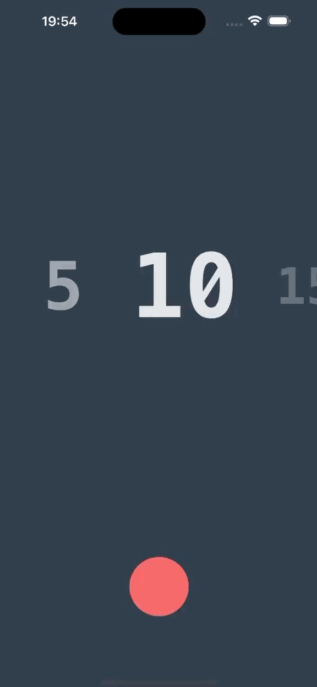
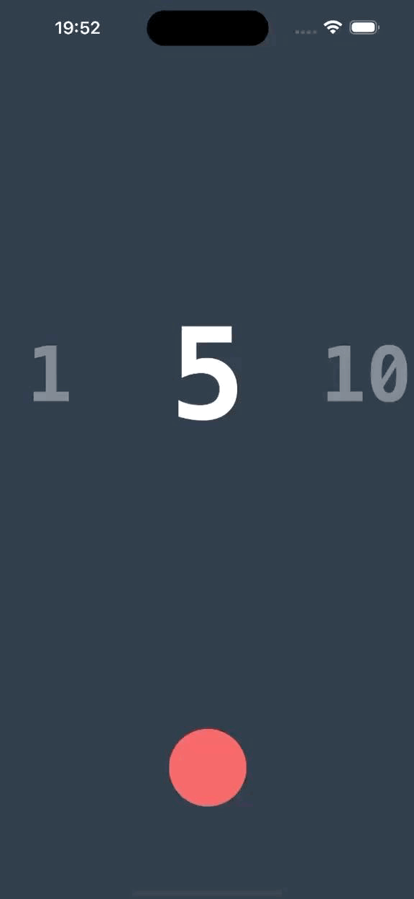

# ⏳ Countdown Timer Animated
Um aplicativo simples desenvolvido em React Native para praticar animações com o hook Animated.

Ele permite selecionar diferentes tempos de contagem e iniciar um timer animado, com efeito visual de preenchimento na tela.

# 🎥 Demonstração

<table>
  <tr>
    <td></td>
    <td></td>
  </tr>
</table>

# ✨ Funcionalidades
- 🎚 Carrossel animado para escolher o tempo (1 segundo, depois de 5 em 5).
- 🎨 Animação de preenchimento de tela representando a passagem do tempo.
- ⏯ Botão central para iniciar a contagem.
- 📱 Interface minimalista e responsiva.

----

# 🛠 Tecnologias Utilizadas
- React Native
- Animated API


# 📂 Estrutura do Projeto
```bash
├── src/
│   └── Timer.tsx   # Componente principal do countdown
├── assets/
│   └── demo1.gif   # Demonstração seleção do tempo
│   └── demo2.gif   # Demonstração animação do timer
└── App.tsx         # Ponto de entrada do app
```

# 🚀 Como Executar
Clone este repositório

```bash
git clone https://github.com/seu-usuario/countdown-timer.git

cd countdown-timer
````

Instale as dependências

```bash
npm install
# ou
yarn install
````

Execute o app

```bash
npm start
# ou
yarn start
```
# 📌 Aprendizados
Esse projeto serviu como prática para:
- Uso de FlatList animada com interpolação de scale e opacity.
- Controle de animações encadeadas usando Animated.sequence.
- Interações simples de UI com animação fluida.

--- 

Feito com 💜 por Yasmin Santana Santos